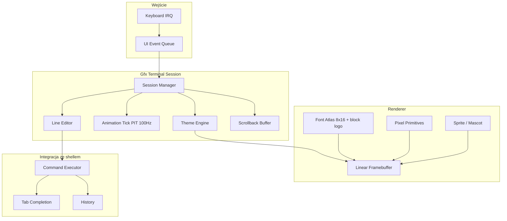

# GFX Terminal — długoterminowy plan (opcja 3)

Terminal framebufferowy inspirowany GitHub Copilot CLI: True Color, własne fonty, animacje, pełna interaktywność.

## Stan wyjściowy (zaimplementowane)

| Komponent | Plik | Status |
|-----------|------|--------|
| Bitmap font renderer | `ui/font.cpp` | Gotowy — wspólny moduł 5×7 px |
| Copilot-style session | `ui/gfx_terminal.cpp` | Faza 0 — welcome screen, input box, animacja intro, kursor |
| Shell entry point | `shell/shell.cpp` → `gfxterm` | Gotowy |
| QEMU launch | `make run-gfxterm` | `-vga std -m 64M` |

### Uruchomienie

```bash
make run-gfxterm
# w shellu:
gfxterm
# wyjście: Q lub Esc
```

Wymaga linear framebuffer z Multiboot (QEMU `-vga std`).

---

## Architektura docelowa



---

## Fazy implementacji

### Faza 0 — Fundament ✅

- [x] Wydzielony moduł `ui/font.cpp`
- [x] Motyw Copilot-dark (czarne tło, lavender logo, różowa maskotka)
- [x] Animacja intro (stopniowe ujawnianie elementów)
- [x] Migający kursor w polu input
- [x] Lokalne polecenia: `help`, `clear`, `pwd`, `exit`
- [x] Polecenie shell `gfxterm`

### Faza 1 — Font atlas i typografia ✅

- [x] Font 8×16 (`ui/font_atlas.cpp`)
- [x] Font block/logo (`ui/font_logo.cpp`)
- [x] `renderer::draw_text_pixels()`
- [x] Styl Smooth (alias atlas)

### Faza 2 — Line editor i scrollback ✅

- [x] Historia poleceń (↑/↓) — `ui/gfx_input.cpp`
- [x] Tab completion — `shell/completion.cpp`
- [x] Home/End, insert/delete — `ui/gfx_input.cpp`
- [x] Scrollback buffer — `ui/gfx_scrollback.cpp`
- [x] PgUp/PgDn scroll — `ui/gfx_terminal.cpp`

### Faza 3 — Integracja ze shellem ✅

- [x] Console backend abstraction — `drivers/console.cpp`
- [x] Przekierowanie VGA → gfx scrollback — `ui/gfx_console.cpp`
- [x] Shell execute w gfxterm — `shell::execute()` w sesji
- [x] Flaga boot `TINYOS_GFX_TERM_AUTOSTART`

### Faza 4 — Animacje i polish ✅

- [x] Typewriter welcome — `ui/gfx_anim.cpp`
- [x] Fade-in logo (alpha)
- [x] Animated mascot (mruganie)
- [x] Smooth cursor opacity
- [x] `@` mention picker — `ui/gfx_picker.cpp`
- [x] `/` command palette — `ui/gfx_picker.cpp`

### Faza 5 — Motywy i konfiguracja ✅

- [x] Theme struct + presets — `ui/gfx_theme.cpp`
- [x] Preset: copilot, dracula, solarized
- [x] `/system/tinyos.conf` w RAMFS
- [x] Polecenie `terminaltheme`
- [x] Polecenie `videomode`

### Faza 6 — Boot UX i produkcja ✅

- [x] Autostart `GFX_TERM_AUTOSTART`
- [x] Fallback VGA gdy brak FB
- [x] Serial mirror via `console::set_serial_mirror`
- [x] CI smoke test `make test-gfxterm-boot`
- [x] Dokumentacja `docs/gfx-terminal-user.md`

---

## Paleta kolorów (Copilot preset)

| Rola | RGB | Użycie |
|------|-----|--------|
| Background | `#000000` | Pełny ekran |
| Foreground | `#F5F5F5` | Tekst główny |
| Dim | `#787878` | Placeholder, stopka |
| Accent | `#C4B5FD` | Logo TINYOS |
| Accent shadow | `#7C6FBA` | Cień logo |
| Border | `#D2D2D2` | Ramka inputu |
| Mascot outline | `#FF69B4` | Obrys maskotki |
| Mascot eye | `#FFFFFF` | Oczy |
| Mascot mouth | `#00FF7F` | „Zęby” |
| Output | `#C8D2DC` | Wyniki poleceń |

---

## Zależności techniczne

```
Faza 0 (fundament)
    └── Faza 1 (font atlas)
            └── Faza 2 (line editor)
                    └── Faza 3 (shell integration)
                            └── Faza 4 (animacje)
                                    └── Faza 5 (motywy)
                                            └── Faza 6 (produkcja)
```

**Blokery zewnętrzne:**
- Linear framebuffer wymaga Multiboot flag + QEMU `-vga std` (lub cirrus/vmware)
- Faza 3 wymaga console backend abstraction (plan Fala 5.9 w `plan-dojrzalosci-systemu.md`)

---

## Szacowany czas

| Faza | Czas | Kumulatywnie |
|------|------|--------------|
| 0 Fundament | 2–3 dni | 3 dni |
| 1 Font atlas | 1 tydzień | 10 dni |
| 2 Line editor | 1.5 tygodnia | 18 dni |
| 3 Shell integration | 2 tygodnie | 32 dni |
| 4 Animacje | 1.5 tygodnia | 42 dni |
| 5 Motywy | 1 tydzień | 49 dni |
| 6 Produkcja | 1 tydzień | **~8 tygodni** |

---

## Powiązane dokumenty

- `docs/plan-dojrzalosci-systemu.md` — Fala 5 (terminal UX)
- `docs/pending-implementation-roadmap.md` — sekcja 9.3 (GUI stack)
- `ui/graphical_desktop.cpp` — istniejący preview desktop z FB
